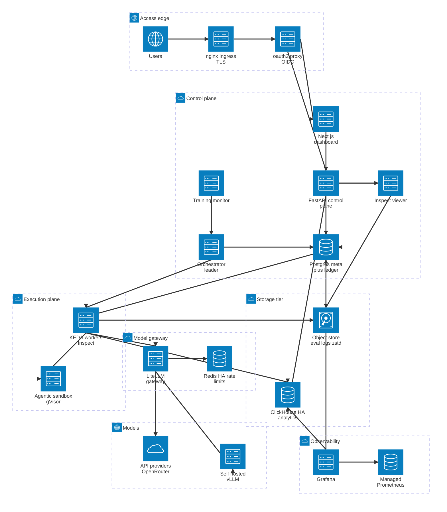

# Eval Engine — System Architecture

A Mermaid `architecture-beta` view of the deployed v1 system: a lightweight **control plane**
(humans + state) and a heavy, KEDA-scaled **execution plane** (compute), talking only through
Postgres + the ephemeral ledger. All model traffic is fronted by the LiteLLM gateway; every
completed sample is flattened into ClickHouse and its transcript/`.eval` log lands in object storage.



## Reading the diagram

**Access edge** — One public entrypoint: nginx Ingress (Let's Encrypt TLS via cert-manager) → all
traffic through **oauth2-proxy** (Google OIDC) → dashboard + API are both gated.

**Control plane** — `frontend` (Next.js: manage / launch / monitor / compare), `api` (FastAPI CRUD,
launch, status, analytics proxy, audit), `orch` (leader-elected admit + expand + reconcile +
finalize), `monitor` (training-checkpoint eval loop — launches ordinary tagged runs), `viewer`
(embedded Inspect log viewer for transcripts), and `pg` (Postgres: run/spec/entity metadata +
the **ephemeral `FOR UPDATE SKIP LOCKED` task ledger** — the sole scheduler).

**Execution plane** — Stateless `workers` (K8s Deployment, **KEDA**-scaled on ledger queue depth)
run a claimed shard as one Inspect Task: claim → execute → commit → load. Agentic harnesses spawn an
ephemeral per-sample **gVisor sandbox** pod. Workers don't coordinate — the ledger does.

**Model gateway** — **LiteLLM** (≥2 replicas) fronts *all* traffic (API providers via OpenRouter
today + self-hosted vLLM), with **Redis HA** holding shared global rate-limit state and the
per-`run_id` cost tally.

**Storage tier** — **ClickHouse** (HA, `ReplicatedReplacingMergeTree`, ~12B-row per-sample
projection; workers async-insert with durable ack *before* flipping the ledger to `done`) and the
**object store** (S3/GCS/MinIO via an fsspec abstraction) holding `.eval` logs + zstd transcripts.

**Observability** — Grafana (dashboards-as-code over ClickHouse + Postgres + Managed Prometheus);
GMP scrapes the fleet.
```
```

## Notes on `architecture-beta`

- Edge labels and free icon packs aren't used so this renders on a stock Mermaid install (only the
  built-in `cloud`/`database`/`disk`/`internet`/`server` icons). The grouping and port directions
  (`:L/:R/:T/:B`) carry the topology; see `DESIGN.md` §6 for the canonical ASCII diagram and rationale.
- The `architecture-beta` label parser rejects `.` and `-` inside `[...]` titles (a syntax error), so
  labels are spelled out (`Next js`, `Self hosted`) rather than `Next.js` / `Self-hosted`.
